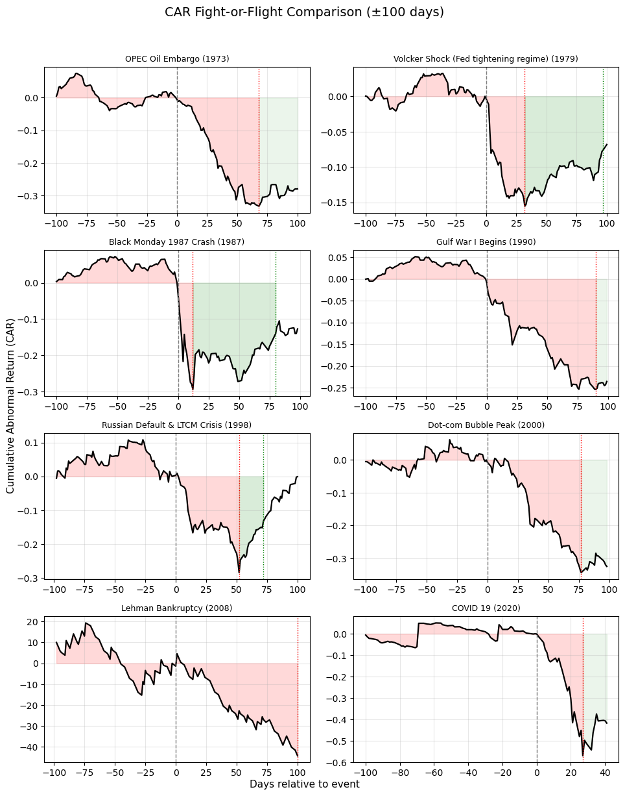
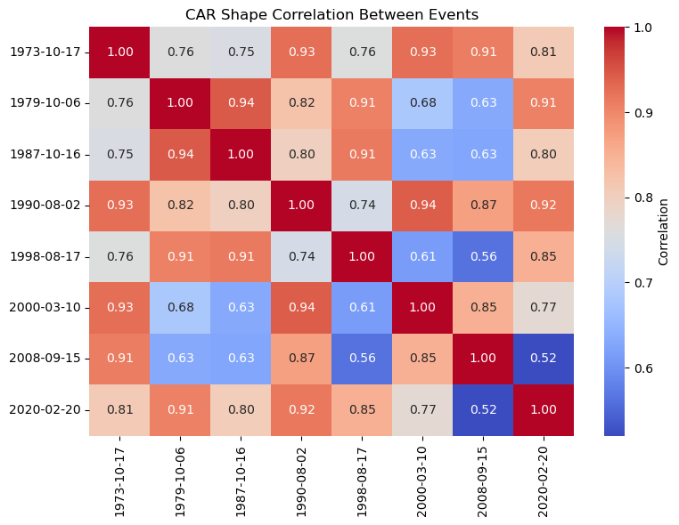
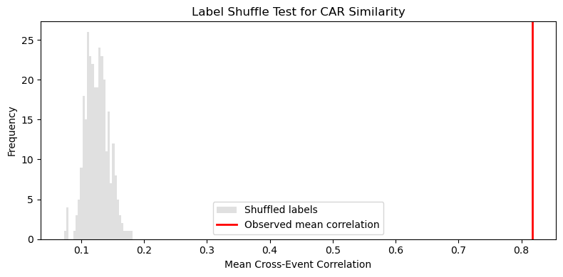
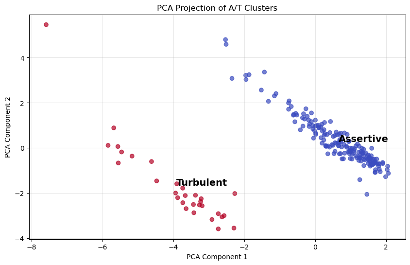
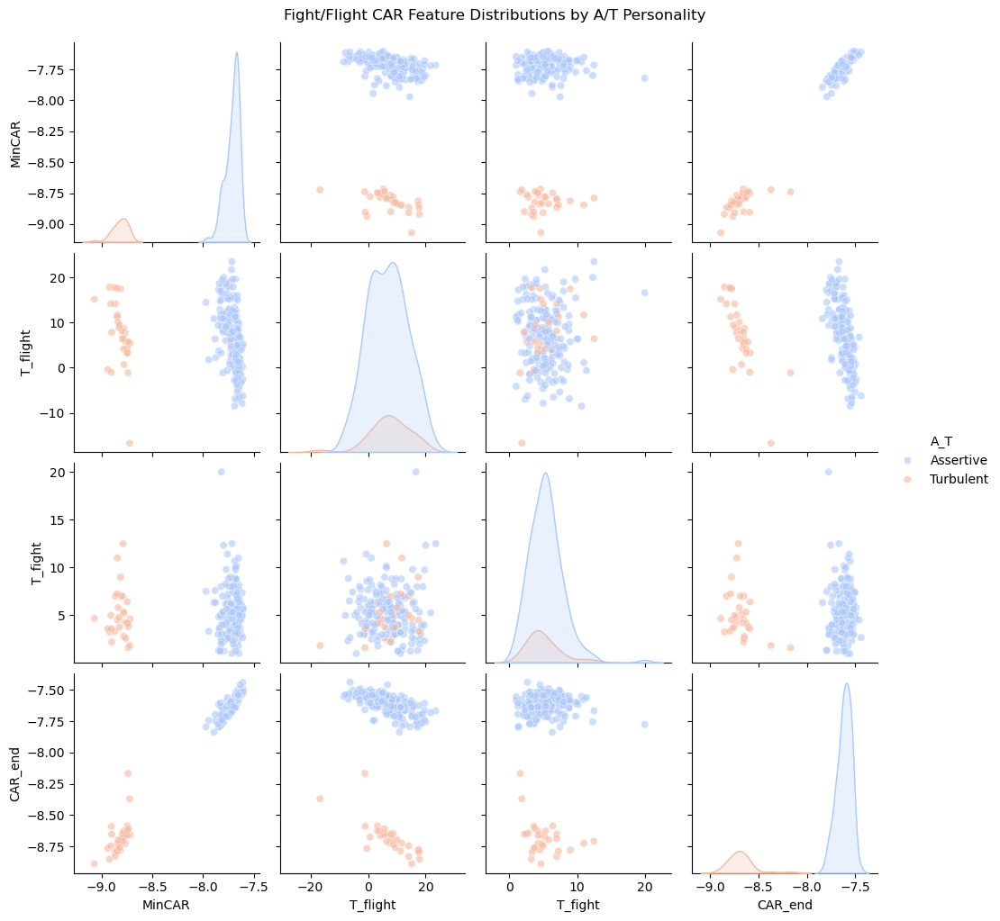
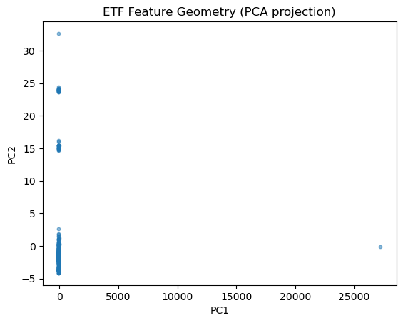
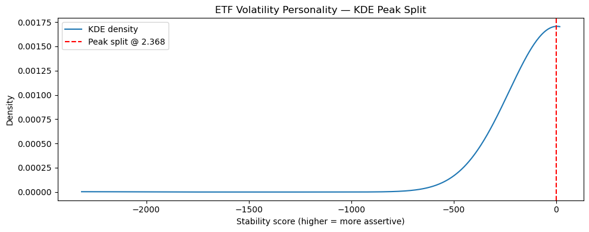

## Motivation: Why Stability vs Reactivity?

<!-- 

  

 -->

Financial markets do not react to external shocks in a uniform way. Even when faced with the same macroeconomic event, different assets, and sometimes the market as a whole, can exhibit fundamentally different *reaction dynamics*.

In this part of the project, we frame market reactions using a **fight-or-flight metaphor**, inspired by behavioral finance and stress-response systems:

The collection of events we analyze are all negative market shocks that result in crashes that is suboptimal for investors, and stocks/etfs are supposed to try their best to recover from the negative shocks. We will be examine two common behaviours in order to assess the response certain stocks/etfs react to the impacts.

- **Flight - panic / shock absorption**  
  How abruptly and how strongly prices or volatility react immediately after an event.

- **Fight - recovery / stabilization**  
  Whether the asset absorbs the shock and stabilizes, or whether stress persists and amplifies.

Given these two behaviours, we target two categories to put the stocks/etfs subject to their behaviours:

- **Stability: Assertive behaviour** corresponds to assets that absorb shocks quickly, limit amplification, and recover efficiently.
- **Reactivity: Turbulent behaviour** corresponds to assets that amplify stress, react violently, and exhibit slow or incomplete recovery.

Importantly, this is **not a psychological label**, but a **structural one**: it describes *how an asset processes information and stress*, not investor sentiment.

---

## What Does Assertive vs Turbulent Mean in This Setting?

In our framework, an asset’s response to an event is characterized by:

1. **Magnitude of reaction** : How large the abnormal response is relative to the market baseline.

2. **Timing of reaction (flight)** : How quickly the peak reaction occurs after the event.

3. **Persistence of stress**: Whether abnormal behaviour dissipates or remains elevated.

4. **Recovery dynamics (fight)**: How long it takes for the asset to revert toward a “normal” state.

An **assertive** asset:
- exhibits smaller abnormal responses,
- reaches its peak reaction quickly,
- and recovers toward baseline within a short horizon.

A **turbulent** asset:
- exhibits larger abnormal responses,
- amplifies stress over time,
- and recovers slowly or not at all within the event window.

This interpretation naturally applies both to **returns** - price impact, and to **volatility** - stress propagation.

---

## Quantifying Market Behaviour — Metrics Used

We quantify market behaviour using **event-study–based features**, computed around predefined macroeconomic or market-wide events.  
The core idea is to isolate how an asset reacts *relative to the market* during periods of stress, rather than measuring raw returns or volatility.

---

### 1. Abnormal Returns and CAR (Stocks)

For individual stocks, we focus on **idiosyncratic price reactions** — that is, how a stock behaves *beyond what can be explained by overall market movements*.

#### Abnormal Return (AR)

The **abnormal return** of a stock at time \( t \) is defined as:

> The difference between the stock’s return and the contemporaneous market return.

In practice, this removes the common market component and isolates firm-specific reactions to an event.

#### Cumulative Abnormal Return (CAR)

The **Cumulative Abnormal Return (CAR)** aggregates abnormal returns over an event window:

> CAR measures the total idiosyncratic price impact of an event over time.

CAR allows us to study not only *whether* a stock reacts, but also *how that reaction evolves*.

From the CAR trajectory, we extract the following behavioural metrics:

- **MinCAR**  
  The minimum value of CAR within the event window.  
  This captures the **maximum drawdown** experienced after the event and serves as a proxy for *panic intensity*.

- **T_flight**  
  The time taken to reach MinCAR after the event.  
  This measures the **speed of the initial shock response**.

- **T_fight**  
  The time required for CAR to recover half of the drawdown from MinCAR.  
  This captures the **speed of stabilization and recovery**.

- **CAR_end**  
  The CAR value at the end of the event window.  
  This measures whether the event impact is **temporary or persistent**.

Together, these metrics characterize a stock’s **price-based fight-or-flight behaviour**.

---

### 2. Abnormal Volatility and CAV (ETFs)

For ETFs, price-based CAR is often less informative due to diversification and index-tracking. Instead, we focus on **volatility dynamics**, which better reflect how stress is transmitted and amplified.

#### Abnormal Volatility (AV)

**Abnormal volatility** is defined as:

> The difference between an ETF’s realized volatility and market volatility at the same time.

This isolates volatility changes that are **specific to the ETF**, rather than driven by overall market conditions.

#### Cumulative Abnormal Volatility (CAV)

The **Cumulative Abnormal Volatility (CAV)** aggregates abnormal volatility over the event window:

> CAV measures how much stress accumulates or dissipates relative to the market after an event.

From the CAV trajectory, we extract the following structural stress metrics:

- **MaxCAV**  
  The maximum value of CAV during the event window.  
  This captures the **peak amplification of volatility**, representing stress magnitude.

- **T_vol_flight**  
  The time taken to reach MaxCAV after the event.  
  This measures the **speed of volatility transmission**.

- **VolRecovery**  
  The time required for CAV to fall below half of its peak value.  
  This captures how quickly the ETF **absorbs and dissipates stress**.

- **CAV_end**  
  The CAV value at the end of the event window.  
  This measures whether volatility shocks are **transitory or persistent**.

<!-- Unlike CAR-based metrics, these features describe **structural robustness and stress propagation**, rather than price direction. -->

### In General

- **CAR-based metrics** capture *price reactions* and are most informative for individual stocks.
- **CAV-based metrics** capture *volatility amplification and persistence* and are more suitable for ETFs.
- They provide a unified, event-driven framework to classify assets as **assertive** or **turbulent** in their response to market stress.

Here we include a visualisation to better illustrate the behaviours we are monitoring:

---

## Do Historically Negative shocks result in similar responses from the market as a whole?

Before stepping into the detailed analysis, we first need to ensure market reacts to negative shocks in a similar fashion, and only under those premises we can treat separate events and the responses to them as a cohesive collection of input for our classification.

To do so, we would need to exmaine the immediate reaction and how similar they are in response to each of the negative shocks. We do so by examine the similarity between the Culmulative Abnormal Returns immediately after the shock. It can be seen from the correlation table between events, the reaction shape exhibits similarity. 

To make sure such correlation is significant, we ran two statistical tests.

1. **Significance Test**: 

If the market truly remembers the past crisises, then the correlations between event CAR shapes should be much higher than the random non-event windows.

2. **Label Shuffle Test**: 

We want to test if the correlation matrix we got depends on specific event alignment, basically meaning it appears purely due to random time-series properties like general volatility clustering.

In order to test that we will shuffle the events and give them the time series of other events, compute the correlation again. If the correlation remains the same, it means the similarity we found is due to generic smoothness or autocorrelation common to all windows. If the correlation is now significantly lower, then it means the specific pairing of CAR curves by real event identity matters, the pattern isn’t random.

With 2 extremely small p-values and the plotted correlation, it's easy to observe that the correlation means are way beyond the normal range and it's not coincidental are not due to generic characteristic of time series

---

## Experimental Design

### Stock Experiments

For stocks, we:

1. Identified a universe of stocks with sufficient historical coverage, which would be sufficient to inspect their reaction to a sufficient amount of events.
2. Computed CAR-based fight-or-flight metrics for each event.
3. Aggregated metrics across events to obtain per-stock behavioural profiles.
4. Standardized features and applied **K-Means clustering (k=2)**.
5. Interpreted clusters as:
   - **Assertive**: shallower drawdowns, faster recovery.
   - **Turbulent**: deeper drawdowns, persistent underperformance.

Stocks with incomplete event coverage were still assigned labels using meanm imputation, allowing predictions even under partial data.

---

### ETF Experiments

For ETFs, we take a different approach:

1. ETFs were filtered by event availability to ensure meaningful volatility estimation.
2. Event-level **CAV-based features** were computed.
3. ETF-level features were aggregated across events.
4. Robust scaling was applied to account for heavy tails and leveraged products.
5. K-Means clustering was used to identify **structural volatility regimes**.

Finally:
- ETFs were **trained on a high-confidence subset** - which have occurrence during multiple events, but **predicted on a broader universe**, allowing classification with as little as one usable event.

For ETFs, the Assertive/Turbulent labels reflect:
- **volatility absorption vs amplification**, not price direction.

---

## Interpretation

### Stocks

Here we present the result of clustering to stocks:

Surprisingly, we have a clear separation for Assertive and Turbulent stocks based on our metrics, let's take a closer look at the implications of this result.

### 1. Drawdown Severity Is the Primary Source of Separation

The clearest distinction between the two groups appears in **MinCAR**:

- Stocks labeled **Assertive** experience **shallower minimum cumulative abnormal returns**, indicating smaller peak drawdowns following events.
- Stocks labeled **Turbulent** exhibit **consistently deeper drawdowns**, with relatively little overlap with the assertive group.

This indicates that the classification is primarily driven by **reaction magnitude**, rather than timing or noise.

---

### 2. Persistence of Impact Differentiates the Groups

A similarly strong separation is visible in **CAR_end**:

- Assertive stocks tend to end the event window with **less negative residual CAR**, suggesting that event-related losses are partially reversed.
- Turbulent stocks often retain **substantially negative CAR** at the end of the window, indicating persistent impact.

Together with MinCAR, this suggests that turbulent behavior is characterized not only by deeper drawdowns, but also by **slower or incomplete reversion**.

---

### 3. Timing Metrics Exhibit Substantial Overlap

In contrast, the timing-related features **T_flight** and **T_fight** show **considerable overlap** between the two groups:

- The **mean reaction time** to the drawdown trough (T_flight) is broadly similar across assertive and turbulent stocks.
- The **mean recovery time** to reclaim half of the drawdown (T_fight) also shows no strong shift between groups.

These metrics therefore do not distinguish the two labels by *average speed* of reaction or recovery.

---

### 4. Timing Captures Variability Rather Than Central Tendency

Although the means are similar, the timing features differ in **dispersion**:

- Assertive stocks tend to occupy a **more compact region** in timing space.
- Turbulent stocks display **wider variability**, including occasional long delays in reaching or recovering from their trough.

This suggests that timing features contribute to the classification by capturing **instability and heterogeneity**, rather than systematic acceleration or delay.

---

### 5. Joint Feature Structure Supports a Regime Interpretation

The off-diagonal panels reveal consistent relationships:

- Stocks with deeper drawdowns almost always exhibit more negative CAR_end.
- Timing variability is larger among turbulent stocks, even when average timing is similar.
- Assertive stocks form a tighter cluster in joint feature space, while turbulent stocks are more dispersed.

This joint structure supports interpreting the labels as **distinct response regimes**, rather than arbitrary partitions.

---

### ETFs

With ETFs, it's a whole new story, the data points before clustering looks like this following:

A clearly clustered plot with some outliers, we might not have a well separated samples as we had in stocks.

Further examine the distribution based on the contribution score, which is computed by combining all the metrics we set for ETFs, the distribution is:

What we have on hand is an extremely asymmetrical distribution, hence the clustering may not be an ideal way to split the ETFs, and the final predictions we obtained are indeed heavily skewed towards Turbulent, with handful instances of Assertive ETFs.

<!-- - Assertive vs Turbulent is **relative**, not absolute.
- Labels depend on:
  - event definitions,
  - window length,
  - feature aggregation choices.
- Assets with fewer events have **lower confidence** labels.

Despite these limitations, the framework provides a **consistent, interpretable way**
to compare how different assets structurally respond to market stress. -->

---

## Summary

This part of project proposes a unified, event-based framework to characterize market behaviour as:

- **Assertive**: controlled, resilient, stabilizing.
- **Turbulent**: amplified, persistent, destabilizing.

By separating **price reactions (stocks)** from **volatility transmission (ETFs)**,
we obtain behaviourally meaningful classifications that go beyond traditional risk metrics.

The result is not a prediction of returns,
but a **map of how assets process shocks**.

  <a class="next-page-button"
     href="{{ '/about/' | relative_url }}">
    Next page →
  </a>

