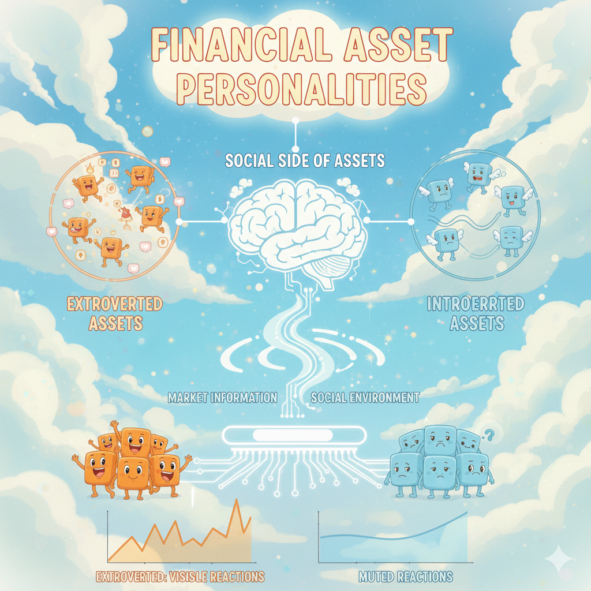
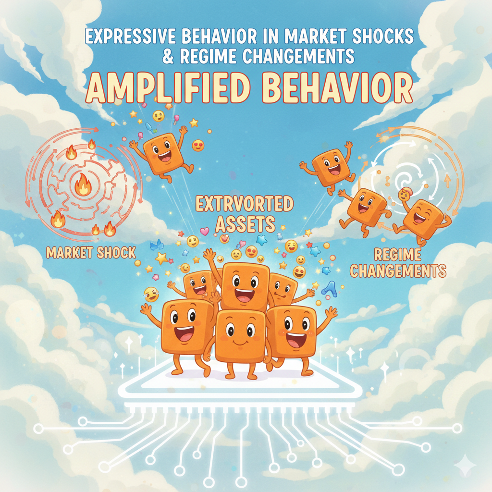
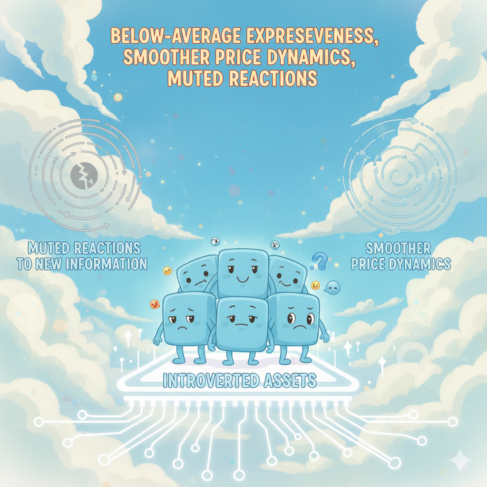

## Extrovertness/Introvertness Index (EI): Definition and Asset Personality Classification

  Financial assets differ not only in their fundamentals, but also in how visibly they react to market information. This "reaction" behavior can be described by the social side of assets; extrovert and introvertness; just like human kind. Aseet's reactions, price mouvements are market dependent; just like humans being impacted by their social environment . 
  
  But, how to measure this social behavior like an asset or like a characteristic that we can define through a metric, personality trait of humans, what is the socialness measure, score, or the threshold that makes an asset introvert or extrovert ? 
  To capture the social dimension of assets, we build social index called "EI Index" (Extrovertness/Introvertness Index ) . This index is based on three measurable values of the assets throught adjusted price time series ; volatility, turnover provy and jump frequency . 
  Volatility is a measurement of how varied the returns of a given security or market index are over time, while turnover proxy is an operational measure of trading activity used to approximate how intensively an asset is traded and jump frequency measures the share of trading days on which absolute returns exceed a fixed multiple of the asset’s own return volatility, symbolizing event-driven side per asset . Together, they reflect the intensity, discontinuity, and participation level of price responses observed in the market . Higher volatility is an indicator of large and frequent price movements, lower volatility indicates the asset's value does not fluctuate dramatically and tends to be steadier . High jump frequency exhibits sharp and irregular price mouvements , low jump frequency indicates large return realizations are rare, and asset prices over time is smooth . High turnover proxy indicates large amoutns of capital are exhanged, and the asset attracts active market participation, low turnover proxy is the indicator of the trading activity to be sparse and small in value . In short, the socialness measure triad is composed of intensity (Volatility), discontinuity (Jump Frequency) and participation (turnover proxy) aspects of the asset. 
  
  
  To allow meaningful cross-sectional comparison, all three components are standardized using z-score normalization. The Emotional Index is then defined as a weighted combination of the standardized components:
  
​
Assets are classified according to the sign of their standardized EI score: for assets that have positive EI scores, it is labeled as "Extroverted" else Introverted.

**Hypotheses Study :**

H1 : Extroversion

Extroverted assets exhibit expressive behaviour in market shocks and in regime changements, amplified behaviour during market shocks. 

H2 : Introversion

Introverted assets display below-average expressiveness, smoother price dynamics and muted reactions to new information. 

Here are some data observation for further social analysis of assets :

*Figure 1 : Side-by-side scatter plots of stocks and ETFs in the normalized personality space defined by volatility and jump frequency.*

*Most Extroverted ETFs*

| Asset | EIz | Vol | Jump | Turnover |  
|------:|--------------:|----:|-----:|---------:|
| PLC | 13.39 | 35.88 | 0.062 | 1.36e+08 |
| RTL | 12.77 | 31.87 | 0.105 | 8.05e+04 |
| SPY | 8.25 | 0.19 | 0.048 | 1.10e+10 |
| QUS  | 6.54  | 17.36 | 0.061 | 8.99e+05 |
| NJAN | 6.06  | 12.25 | 0.124 | 2.24e+05 |

*Figure 2: Highly extroverted ETFs (e.g., PLC, RTL, SPY) exhibit pronounced volatility and frequent jump activity, consistent with elevated market expressiveness. PLC and RTL display strong, discontinuous reactions around announcements and regime shifts, reflecting episodes in which market participants concentrate information flow and repositioning through these assets. SPY exhibits sustained extroversion as a central vehicle for trading, hedging, and price discovery, continuously transmitting market-wide information. QUS and NJAN show conditional extroversion, becoming expressive primarily during factor rotations or calendar-driven reallocations. Overall, these patterns are consistent with H1, confirming that extroversion corresponds to heightened market-level information processing and transmission.*

*Most Introverted ETFs*

| Asset | EIz | Vol | Jump | Turnover |
|------:|--------------:|----:|-----:|---------:|
| TFLO | -0.96 | 0.028 | 0.0045 | 1.82e+06 |
| GSY | -0.96 | 0.052 | 0.0043 | 7.25e+06 |
| NEAR | -0.89 | 0.029 | 0.0067 | 3.05e+07 |
| FFIU | -0.87 | 0.467 | 0.0015 | 1.38e+05 |
| FLOT | -0.87 | 0.044 | 0.0072 | 4.17e+07 |

*Figure 3: Introverted ETFs exhibit muted price dynamics and rare discontinuities, consistent with below-average market expressiveness. Even in the presence of non-trivial trading activity, price adjustments remain smooth and stable, indicating subdued reactions to new information. This behavior reflects a market-level form of restraint: these assets tend to absorb information quietly and remain comparatively insulated from short-term market fluctuations, rather than amplifying shocks. Overall, the observed patterns support H2, confirming that introversion captures restrained market expressiveness rather than illiquidity, neglect, or mechanical price rigidity.*

*Most Extroverted Stocks*

| Asset | EIz | Vol | Jump | Turnover |
|------:|--------------:|----:|-----:|---------:|
| DTP | 16.70 | 66.89 | 0.163 | 4.73e+05 |
| MEC | 14.17 | 60.60 | 0.108 | 8.39e+06 |
| HMI | 10.82 | 42.43 | 0.132 | 6.65e+05 |
| PBC | 9.89 | 48.82 | 0.025 | 2.83e+07 |
| EIC | 8.80 | 35.29 | 0.109 | 2.16e+06 |

*Figure 4 : Extroverted stocks such as DTP, MEC, and HMI exhibit extreme volatility and frequent jump activity, indicating high market expressiveness. Rather than reflecting intrinsic firm characteristics, this behavior captures episodes in which market participants concentrate information processing and repositioning through these assets. As a result, they function as conduits for idiosyncratic information flow, transmitting shocks rapidly via large and discontinuous price movements.*

*Most Introverted Stocks*

| Asset | EIz | Vol | Jump | Turnover |
|------:|--------------:|----:|-----:|---------:|
| AAN   | -15.21 | 0.413 | 0.052 | -2.82e+25 |
| EVSTC | -0.99  | 0.343 | 0.001 | 2.00e+05 |
| EVLMC | -0.99  | 0.347 | 0.001 | 1.92e+05 |
| EVGBC | -0.99  | 0.347 | 0.001 | 1.77e+05 |
| CARR# | -0.92  | 0.575 | 0.002 | 2.24e+04 |

*Figure 5 : Introverted stocks exhibit persistently low Emotional Index (EI) scores, reflecting below-average market expressiveness. Their price dynamics are comparatively stable, with few abrupt movements and muted reactions to new information, even when trading activity is non-trivial. This behavior is consistent with a market-level form of restraint, whereby information is absorbed smoothly rather than transmitted through sharp price adjustments. In isolated cases (e.g., AAN), extreme EI values arise from data sparsity or structural trading constraints rather than genuine behavioral intensity, and are therefore interpreted as measurement artifacts rather than deviations from the underlying pattern.* 

<noscript>
  
</noscript>

*Figure 6. Asset behavior across three market metrics. Higher values indicate more reactive assets, while lower values reflect more stable behavior, illustrating how the Emotional Index (EI) relates to underlying market dynamics. The figure shows a subset of 30 assets for clarity.*

<noscript>
  
</noscript>

*Figure 7. Friendship network illustration for selected stocks, constructed from log-returns computed using adjusted closing prices. For each pair of assets, the Pearson correlation of returns is computed; if the absolute correlation exceeds 0.5, the assets are considered connected.*

<noscript>
  
</noscript>

*Figure 8. Friendship network illustration for selected ETFs, constructed from log-returns, if the absolute Pearson correlation exceeds 0.5, the assets are considered connected.*
