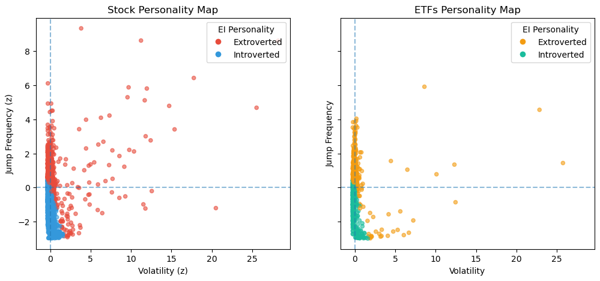

## Emotional Index (EI): Definition and Asset Personality Classification

To characterize the behavioral profile of financial assets, we construct an **Emotional Index (EI)** based on observable market dynamics. For each asset (stock or ETF), three complementary components are computed from historical price and volume data: **volatility**, **jump frequency**, and a **turnover proxy**. Each component captures a distinct aspect of market behavior and is computed independently for each asset.

**Volatility** is defined as the annualized standard deviation of daily log-returns and reflects the magnitude of price fluctuations.  
**Jump frequency** measures the proportion of trading days on which absolute daily returns exceed a fixed multiple of the asset’s own return volatility, capturing abrupt and event-driven price movements.  
The **turnover proxy** is computed as average daily dollar volume and serves as a measure of liquidity and trading intensity.

To enable cross-sectional comparison, all three components are standardized across assets using z-score normalization. The standardized Emotional Index is then defined as a weighted linear combination of the normalized components:

$EI_z = 0.5 \times volatility_z + 0.3 \times jumpfrequency_z + 0.2 \times turnover_z$

This formulation assigns greater importance to price variability and discontinuities while retaining liquidity as a complementary signal. The resulting EI score quantifies the relative behavioral activity of an asset with respect to the market as a whole.

Asset personality is derived through a binary classification rule applied to the standardized EI score. Assets with  
$EI_z > 0$
 are labeled **extroverted**, indicating above-average behavioral intensity, while assets with  
$EI_z > 0$
 are labeled **introverted**, corresponding to below-average market activity. No additional thresholds or nonlinear transformations are introduced; the classification boundary coincides with the cross-sectional mean.

From a conceptual standpoint, **extroverted assets** are characterized by higher volatility, more frequent jump events, and elevated trading activity, leading to stronger and more visible reactions to market information. In contrast, **introverted assets** exhibit more stable price dynamics, fewer abrupt movements, and lower trading intensity. The EI score therefore provides a single behavioral axis that positions assets relative to their peers based on consistent and observable market signals.

To ensure robustness, assets are required to satisfy minimum data availability constraints. In particular, at least **30 return observations** are necessary for reliable estimation of volatility and jump frequency. Assets with insufficient data or missing component values are excluded from scoring. Only assets with valid measurements for all three components are assigned an EI score and personality label.

Here are some data observation for further social analysis of assets :

*Figure 1 : Side-by-side scatter plots of stocks and ETFs in the normalized personality space defined by volatility and jump frequency.*

**Most Extroverted ETFs**

| Asset | EI scorez | Volatility | Jump frequency | Turnover |
|------:|---------------------:|-----------:|---------------:|---------:|
| PLC  | 13.39 | 35.88 | 0.062 | 1.36e+08 |
| RTL  | 12.77 | 31.87 | 0.105 | 8.05e+04 |
| SPY  | 8.25  | 0.19  | 0.048 | 1.10e+10 |
| QUS  | 6.54  | 17.36 | 0.061 | 8.99e+05 |
| NJAN | 6.06  | 12.25 | 0.124 | 2.24e+05 |

**Most Introverted ETFs**

| Asset | EI scorez | Volatility | Jump frequency | Turnover |
|------:|---------------------:|-----------:|---------------:|---------:|
| TFLO | -0.96 | 0.028 | 0.0045 | 1.82e+06 |
| GSY  | -0.96 | 0.052 | 0.0043 | 7.25e+06 |
| NEAR | -0.89 | 0.029 | 0.0067 | 3.05e+07 |
| FFIU | -0.87 | 0.467 | 0.0015 | 1.38e+05 |
| FLOT | -0.87 | 0.044 | 0.0072 | 4.17e+07 |

**Most Introverted Stocks**

| Asset | EI scorez | Volatility | Jump frequency | Turnover |
|------:|---------------------:|-----------:|---------------:|---------:|
| AAN   | -15.21 | 0.413 | 0.052 | -2.82e+25 |
| EVSTC | -0.99  | 0.343 | 0.001 | 2.00e+05 |
| EVLMC | -0.99  | 0.347 | 0.001 | 1.92e+05 |
| EVGBC | -0.99  | 0.347 | 0.001 | 1.77e+05 |
| CARR# | -0.92  | 0.575 | 0.002 | 2.24e+04 |

**Most Extroverted Stocks**

| Asset | EI scorez | Volatility | Jump frequency | Turnover |
|------:|---------------------:|-----------:|---------------:|---------:|
| DTP | 16.70 | 66.89 | 0.163 | 4.73e+05 |
| MEC | 14.17 | 60.60 | 0.108 | 8.39e+06 |
| HMI | 10.82 | 42.43 | 0.132 | 6.65e+05 |
| PBC | 9.89 | 48.82 | 0.025 | 2.83e+07 |
| EIC | 8.80 | 35.29 | 0.109 | 2.16e+06 |

<noscript></noscript>

*Figure 2 : Asset behavior across three metrics . Higher peaks indicate more reactive assets, while lower values reflect more stable behavior, illustrating how the EI score relates to underlying market dynamics. Graph includes only 30 assets for illustration purposes*

</script><noscript></noscript>

*Figure 3 : Friendship network illustration for some stocks, constructed from log-returns computed from adjusted closing prices. For each pair of assets, the Pearson correlation of returns is calculated; if the absolute correlation exceeds 0.5, the two assets are considered a connected *

</script><noscript></noscript>

*Figure 4 : Friendship network illustration for some ETFs, constructed from log-returns computed from adjusted closing prices. For each pair of assets, the Pearson correlation of returns is calculated; if the absolute correlation exceeds 0.5, the two assets are considered a connected *
