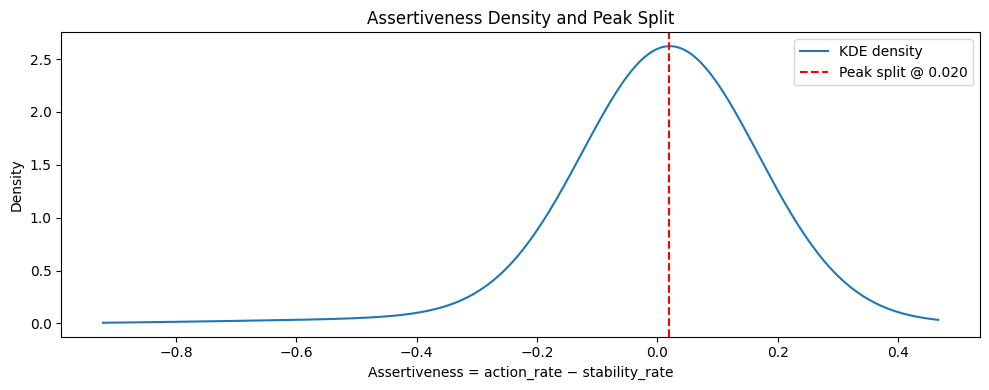

## Intrinsic Confidence: Definition and Asset Personality Classification

This page introduces a **purely intrinsic** (event-free) behavioral axis that describes how a stock/ETF *moves* rather than *why it moves*.

The key idea is to “humanize” market behavior by extracting **tendencies from the shape of motion itself**:
- Does the asset accelerate upward and keep going (riding a wave)?
- Does it slow down while still rising (controlled discipline)?
- Does it spiral down and accelerate (descent)?
- Does it fall but start resisting (tenacity)?

No external datasets are used. This analysis can be run on **any dataset with the same structure** (daily Date + Close/Adj Close).

---

## 1) Preprocessing: Smoothing the Price (Intrinsic Only)

Raw close prices are noisy, and derivatives amplify noise.  
So we compute a smoothed price \(P(t)\) using:

1) **Exponential Moving Average (EMA)** with span `EMA_SPAN`  
2) Optional **rolling mean** with window `ROLL_WIN`

\[
P(t) = \text{RollMean}(\text{EMA}(\text{Close}(t)))
\]

**Interpretation:** we are not “changing” the trend — we’re filtering micro-noise so that the slope/curvature reflect real movement.

---

## 2) Derivatives: Momentum and Acceleration

From the smoothed price \(P(t)\), we compute:

- **First derivative**:  
  \[
  P'(t) \approx \nabla P(t)
  \]
  (interpreted as **intrinsic momentum**, up vs down)

- **Second derivative**:  
  \[
  P''(t) \approx \nabla(P'(t))
  \]
  (interpreted as **intrinsic acceleration**, strengthening vs weakening)

In code, this is implemented using `np.gradient` with \(dt=1\) day.

---

## 3) Four Regimes (Quadrants of \(P'\) vs \(P''\))

Each day is labeled into one of four regimes based on the sign of \(P'(t)\) and \(P''(t)\):

| Regime | Condition | Human analogy |
|---:|---|---|
| **Confidence** | \(P'(t)>0\) and \(P''(t)>0\) | moving up and accelerating (“rides the wave”) |
| **Discipline** | \(P'(t)>0\) and \(P''(t)<0\) | still rising but slowing (“controlled / consolidating”) |
| **Descent** | \(P'(t)<0\) and \(P''(t)<0\) | falling and accelerating downward (“downward spiral”) |
| **Tenacity** | \(P'(t)<0\) and \(P''(t)>0\) | still falling but resisting (“trying to recover”) |

Gummyworm-like Plot:

---

## 4) Minimal Feature Extraction (Behavior, Not Performance)

Instead of extracting a large feature vector, we intentionally keep it minimal and interpretable.

For each symbol we compute:

### A) Time spent in regimes (days)

Let \(N\) be the number of valid days.  
Let \(D_{\text{conf}}, D_{\text{disc}}, D_{\text{desc}}, D_{\text{tena}}\) be the number of days in each regime.

We define:

- **Action rate** (active directionality):
\[
\text{ActionRate} = \frac{D_{\text{conf}} + D_{\text{desc}}}{N}
\]

- **Stability rate** (controlled / regulated motion):
\[
\text{StabilityRate} = \frac{D_{\text{disc}} + D_{\text{tena}}}{N}
\]

### B) Assertiveness score (single scalar)

\[
\text{Assertiveness} = \text{ActionRate} - \text{StabilityRate}
\]

**Interpretation:**
- High assertiveness → spends more time in “push” regimes (confidence + descent)
- Low assertiveness → spends more time in “control” regimes (discipline + tenacity)

---

## Distribution Analyses and Final Separation (Stocks + ETFs)

At this point, every asset (stock or ETF) has a single scalar score: **Assertiveness**.  
We now study its distribution and convert it into a **binary letter**:

- **A (Assertive)**: more “push” behavior (confidence + descent dominates)
- **R (Restrained)**: more “control” behavior (discipline + tenacity dominates)

We run the same pipeline **twice**: once for **stocks**, once for **ETFs**.

---

### Analysis 1: KDE “Bell Curve” + Peak Split (Mode)

When we plot assertiveness across all assets, we typically see a **single-peaked, bell-shaped distribution** (approximately unimodal).  
That’s exactly what many human-like traits look like at population scale: **most are moderate**, with **fewer extremes**.

So instead of forcing two “natural clusters,” we use a **mode split**:

- Compute a smooth density estimate (KDE)
- Find the **peak** of the density (the **mode**)
- Split by that peak:
  - Assertiveness **> mode** → **A**
  - Assertiveness **< mode** → **R**

This is a “human-style” classification: a continuous trait → a binary letter around the most typical behavior.

**Stocks — resulting proportions**
- **A (Assertive):** `52%`
- **R (Restrained):** `48%`

**ETFs — resulting proportions**
- **A (Assertive):** `54%`
- **R (Restrained):** `46%`

> The exact percentages are printed by the notebook after the split.

---

---

## Interpretation: Why the Bell Curve Matters

A clean two-cluster split would suggest the market naturally separates into two distinct “species.”  
But what we observe is closer to a **continuum**: a spectrum of assertiveness with a common center.

That’s not a failure, it’s the point.

This bell-curve behavior mirrors how many **human traits** appear at population scale:
- most are moderate,
- extremes exist but are rarer,
- and binary letters (A/R) are *compressions of a continuous trait* rather than evidence of true “two types.”

So the final outcome of this axis is simple and usable:

> **Every stock/ETF gets a letter: A (Assertive) or R (Restrained).**
