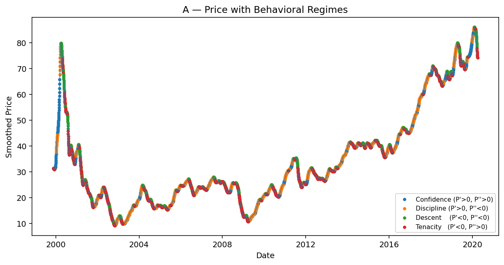
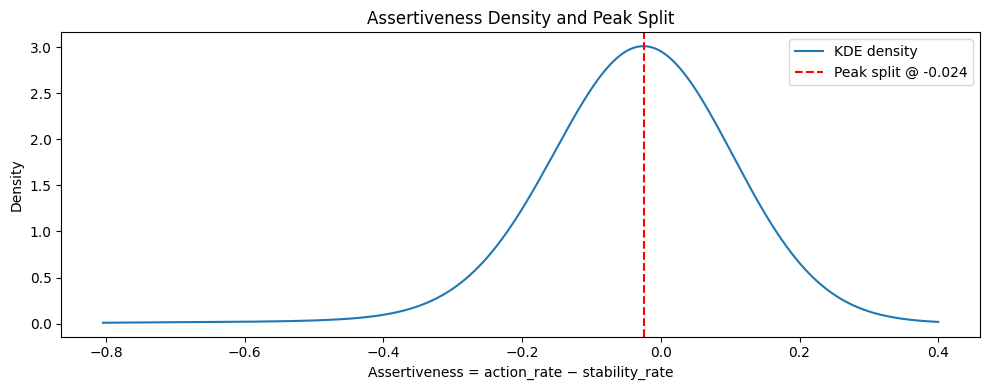

## Intrinsic Confidence Axis: Definition and Asset Personality Classification

This page introduces a **purely intrinsic** (event-free) behavioral axis that describes how a stock/ETF *moves* rather than *why it moves*.

The key idea is to “humanize” market behavior by extracting **tendencies from the shape of motion itself**:
- Does the asset accelerate upward and keep going (riding a wave)?
- Does it slow down while still rising (controlled discipline)?
- Does it spiral down and accelerate (descent)?
- Does it fall but start resisting (tenacity)?

No external datasets are used. This analysis can be run on **any dataset with the same structure** (daily Date + Close/Adj Close).

---

## 1) Preprocessing: Smoothing the Price (Intrinsic Only)

Raw close prices are noisy, and derivatives amplify noise.  
So we compute a smoothed price \(P(t)\) using:

1) **Exponential Moving Average (EMA)** with span `EMA_SPAN`  
2) Optional **rolling mean** with window `ROLL_WIN`

\[
P(t) = \text{RollMean}(\text{EMA}(\text{Close}(t)))
\]

**Interpretation:** we are not “changing” the trend — we’re filtering micro-noise so that the slope/curvature reflect real movement.

---

## 2) Derivatives: Momentum and Acceleration

From the smoothed price \(P(t)\), we compute:

- **First derivative**:  
  \[
  P'(t) \approx \nabla P(t)
  \]
  (interpreted as **intrinsic momentum**, up vs down)

- **Second derivative**:  
  \[
  P''(t) \approx \nabla(P'(t))
  \]
  (interpreted as **intrinsic acceleration**, strengthening vs weakening)

In code, this is implemented using `np.gradient` with \(dt=1\) day.

---

## 3) Four Regimes (Quadrants of \(P'\) vs \(P''\))

Each day is labeled into one of four regimes based on the sign of \(P'(t)\) and \(P''(t)\):

| Regime | Condition | Human analogy |
|---:|---|---|
| **Confidence** | \(P'(t)>0\) and \(P''(t)>0\) | moving up and accelerating (“rides the wave”) |
| **Discipline** | \(P'(t)>0\) and \(P''(t)<0\) | still rising but slowing (“controlled / consolidating”) |
| **Descent** | \(P'(t)<0\) and \(P''(t)<0\) | falling and accelerating downward (“downward spiral”) |
| **Tenacity** | \(P'(t)<0\) and \(P''(t)>0\) | still falling but resisting (“trying to recover”) |

Two visualizations are commonly used:

---

## 4) Minimal Feature Extraction (Behavior, Not Performance)

Instead of extracting a large feature vector, we intentionally keep it minimal and interpretable.

For each symbol we compute:

### A) Time spent in regimes (days)
Let \(N\) be the number of valid days.  
Let \(D_{\text{conf}}, D_{\text{disc}}, D_{\text{desc}}, D_{\text{tena}}\) be the number of days in each regime.

We define:

- **Action rate** (active directionality):
\[
\text{ActionRate} = \frac{D_{\text{conf}} + D_{\text{desc}}}{N}
\]

- **Stability rate** (controlled / regulated motion):
\[
\text{StabilityRate} = \frac{D_{\text{disc}} + D_{\text{tena}}}{N}
\]

### B) Assertiveness score (single scalar)
\[
\text{Assertiveness} = \text{ActionRate} - \text{StabilityRate}
\]

**Interpretation:**
- High assertiveness → spends more time in “push” regimes (confidence + descent)
- Low assertiveness → spends more time in “control” regimes (discipline + tenacity)

---

## Bell Curve Split: Assertive vs Restrained (No Forced Clustering)

Because the assertiveness distribution typically forms a **bell curve** (like many human traits),
we do **not** expect two clean clusters.

Instead, we separate the population by splitting at the **peak (mode)** of the distribution:

- Values **right of the peak** → **A (Assertive)**
- Values **left of the peak** → **R (Restrained)**

This produces an interpretable binary label **without pretending the population is naturally clustered**.

---

## Outputs

The pipeline generates:
1) A feature table:
- `confidence_minimal_features_stocks.csv` (or `_etfs.csv`)

2) A label file with exactly two columns:
- `symbol`
- `AR` where `AR ∈ {A, R}`

Example schema:

| symbol | AR |
|---|---|
| AAPL | A |
| MSFT | R |

---

## Example Observations (Optional)

Assets in the **upper-right** region spend more time in “high-motion” regimes overall.  
Assets closer to the diagonal show balanced behavior between “action” and “control”.

---

## Notes / Limitations

- This axis does **not** measure value or fundamentals.
- The result depends on smoothing choices (`EMA_SPAN`, `ROLL_WIN`) because derivatives are noise-sensitive.
- Regimes are intrinsic: they reflect internal dynamics, not the cause (news/events/etc).
